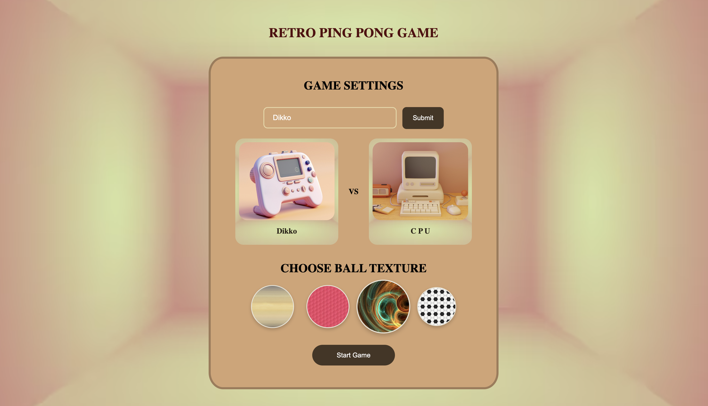
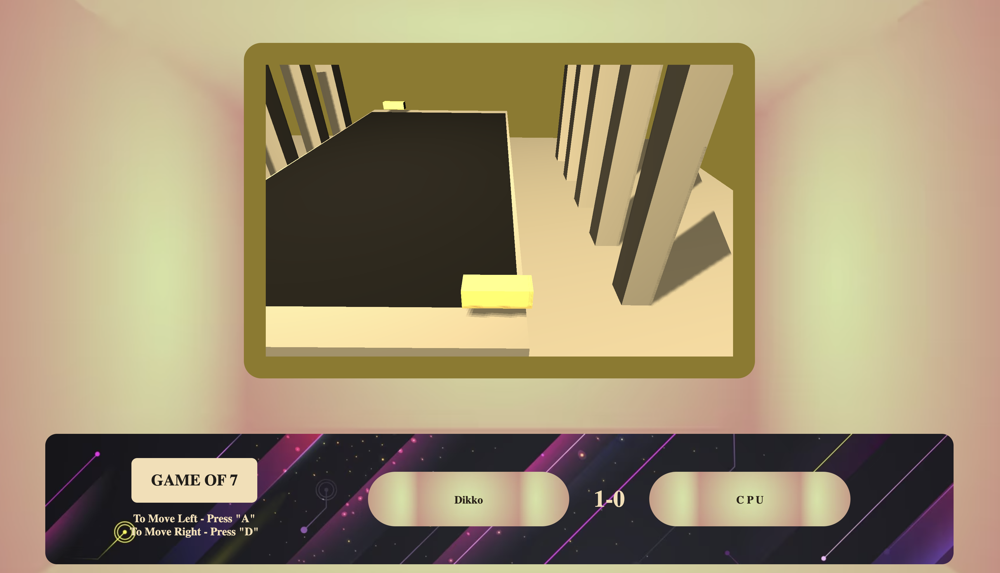

# Retro Ping Pong Game

## Project Overview

Retro Ping Pong is a 3D pong game developed using modern web technologies. It's a nostalgic take on the classic table tennis-themed sports game with a fresh 3D perspective. This project utilizes `Three.js` for 3D rendering and `Howler.js` for audio processing, providing an immersive gaming experience.

## Game Screenshots

### Settings Screen


### Gameplay Screen



### Features

#### Immersive 3D Game Environment
- Utilizes Three.js for creating a visually appealing and interactive 3D environment.
- Detailed rendering of the ping pong table, paddles, and ball to enhance the gaming experience.
- Dynamic shadows and lighting effects that change in real-time, contributing to the realism of the game.
- 3D animations for paddle movements and ball bounces, adding depth to the gameplay.

#### High-Quality Audio with Howler.js
- Background music and sound effects powered by Howler.js for an immersive audio experience.
- Ambient sounds to enhance the game atmosphere.

#### Customization Options
- Players can enter their names, which are then displayed on the game screen, adding a personal touch.
- Multiple ball textures to choose from, allowing players to personalize their game.

#### Gamepad and Controller Support
- Compatible with various game controllers for a more intuitive and engaging gameplay experience.
- Smooth integration of controller input for controlling the paddle movements.
- Ability to pause and resume the game using the gamepad.

#### User-Friendly Interface
- Simple and intuitive user interface, ensuring a smooth user experience.
- Clear instructions and guidance provided for first-time players.
- Easy navigation between the game settings page and the main game.

## Getting Started

### Prerequisites

To run this project locally, you'll need:

- A modern web browser.
- Node.js or Python installed on your system for setting up a local server.

### Running the Game

#### Using Node.js

1. Install `http-server` globally via npm:
   ```bash
   npm install -g http-server
   ```
2. Navigate to the project directory and start the server:
   ```bash
   http-server
   ```
3. Open your web browser and go to `http://localhost:8080`.

#### Using Python

1. Navigate to the project directory.
2. If you have Python 3.x installed, start the server using:
   ```bash
   python -m http.server
   ```
   For Python 2.x, use:
   ```bash
   python -m SimpleHTTPServer
   ```
3. Open your web browser and go to `http://localhost:8000`.

### Directory Structure

- `index.html`: The landing page where players can enter their names and choose ball textures.
- `game.html`: The main game interface.
- `styles/`: Contains CSS files for styling.
- `scripts/`:
    - `game.js`: The core game logic.
    - `keyboard.js`: Handles keyboard inputs.
    - `three.min.js`: Three.js library for 3D rendering.
- `img/`: Contains images and textures used in the game.
- `howler.js/`: Contains the Howler.js library for audio processing.

## Game Instructions

1. **Start Screen (`index.html`):**
    - Enter your name in the provided field.
    - Choose a ball texture by clicking on one of the texture options.
    - Click "Start Game" to begin.

2. **Gameplay (`game.html`):**
    - Use the "A" and "D" keys to move the paddle left and right, respectively.
    - The game is played against a computer-controlled opponent (CPU).
    - The first player to reach 7 points wins the game.

3. **Controller Support:**
    - Connect a game controller.
    - Use the D-pad or joystick to control the paddle.
    - Press the specified buttons to pause or resume the game.

## Technologies Used

- **Three.js:** A JavaScript 3D library that makes WebGL simpler.
- **Howler.js:** An audio library for the modern web.
- **HTML/CSS/JavaScript:** For structuring, styling, and scripting the game.


## Development

### Scripts

- `index.js`: Script for the settings page (`index.html`). It handles player name input, texture selection, and redirects to the main game page.
- `game.js`: Main game script (`game.html`). It contains all the logic for the 3D rendering of the game environment, paddle movements, ball physics, scoring system, and game controls.

### Controllers

The game supports gamepad controllers for a more interactive experience. Ensure your controller is connected and recognized by your browser.

## Acknowledgments and References

- Three.js Contributors - for the Three.js library.
- Howler.js Contributors - for the Howler.js audio library.
- Tutorial on Creating a 3D Game With Three.js and WebGL http://buildnewgames.com/webgl-threejs/
- Reddit Forum - https://www.reddit.com/r/programming/comments/1j5kem/creating_a_3d_game_with_threejs_and_webgl/